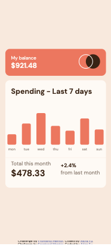

# Frontend Mentor - Expenses chart component solution

This is a solution to the [Expenses chart component challenge on Frontend Mentor](https://www.frontendmentor.io/challenges/expenses-chart-component-e7yJBUdjwt). Frontend Mentor challenges help you improve your coding skills by building realistic projects.

## Table of contents

-   [Overview](#overview)
    -   [The challenge](#the-challenge)
    -   [Screenshot](#screenshot)
    -   [Links](#links)
-   [My process](#my-process)
    -   [Built with](#built-with)
    -   [What I learned](#what-i-learned)
    -   [Continued development](#continued-development)
    -   [Useful resources](#useful-resources)
-   [Author](#author)

## Overview

### The challenge

Users should be able to:

-   View the bar chart and hover over the individual bars to see the correct amounts for each day
-   See the current day’s bar highlighted in a different colour to the other bars
-   View the optimal layout for the content depending on their device’s screen size
-   See hover states for all interactive elements on the page
-   **Bonus**: Use the JSON data file provided to dynamically size the bars on the chart

### Screenshot




### Links

-   Solution URL: [https://github.com/akiraafu/expenses-chart-component]
-   Live Site URL: [https://expenses-chart-component-1bpj8ycj2-akiraafu.vercel.app]

## My process

### Built with

-   Semantic HTML5 markup
-   CSS custom properties
-   Flexbox
-   CSS Grid
-   JavaScript
-   Google Charts

### What I learned

Use this section to recap over some of your major learnings while working through this project. Writing these out and providing code samples of areas you want to highlight is a great way to reinforce your own knowledge.

To see how you can add code snippets, see below:

```css
.proud-of-this-css {
    .chart .google-visualization-tooltip ul li:first-child {
        display: none;
    }

    .chart .google-visualization-tooltip span:before {
        content: "$";
    }
}
```

```js
const proudOfThisFunc = () => {
    import data from "./data.json" assert { type: "json" };

    let newArr = [];

    for (let i = 0; i < data.length; i++) {
        let day = Object.values(data[i]);
        newArr.push(day);
    }
};
```

### Continued development

none

### Useful resources

-   [Google Charts](https://developers.google.com/chart) Column Chart
-   [MDN](https://developer.mozilla.org/)

## Author

-   Website - [akiraafu](https://github.com/akiraafu)
-   Frontend Mentor - [@akiraafu](https://www.frontendmentor.io/profile/akiraafu)
